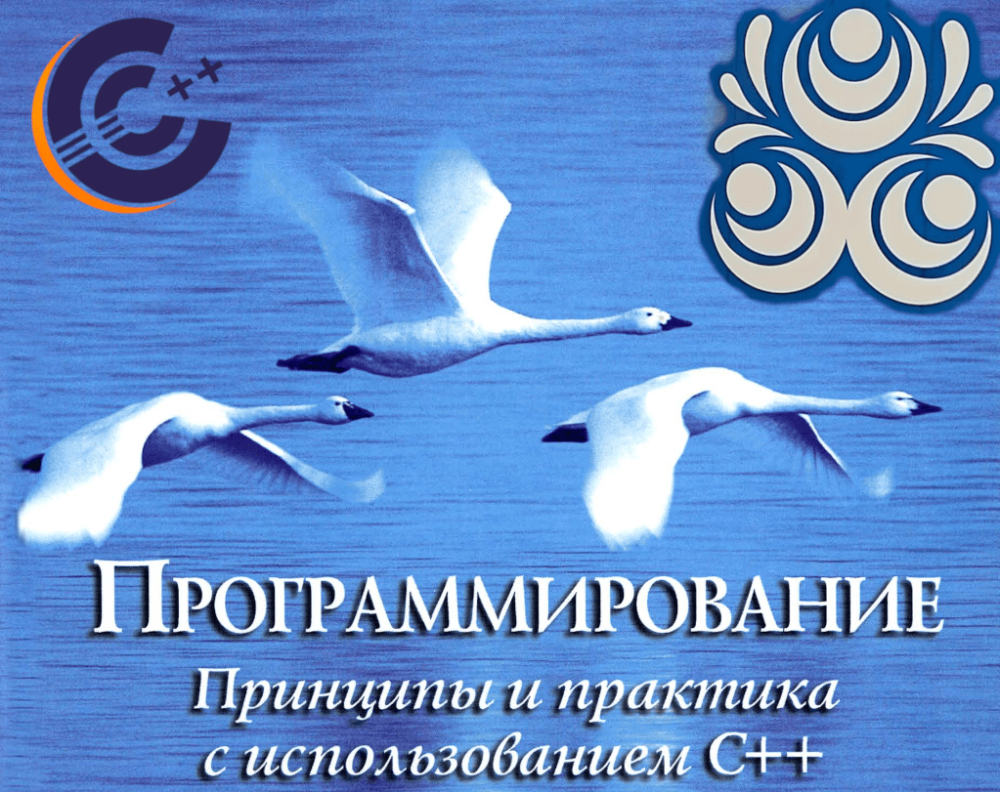

# Programming with C++

Supplementary course materials for students. Based on the textbook _Programming: Principles and Practice Using C++_ by Bjarne Stroustrup



_Inspired by all students who are eager to learn_


## Build

The document is written using [LaTeX](https://www.latex-project.org). To build it, just run the command:

```
$ make
```
